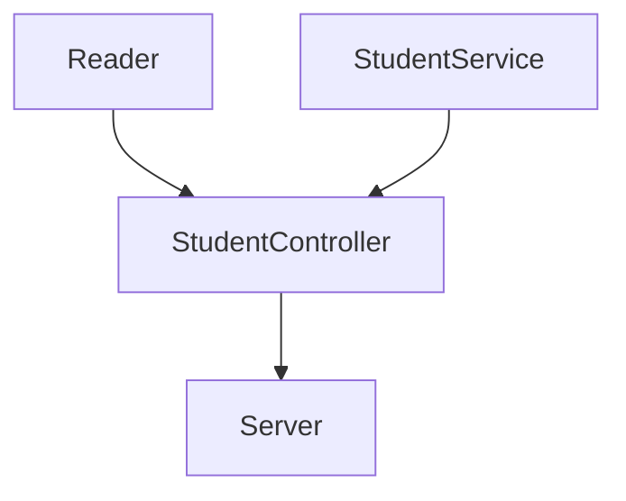
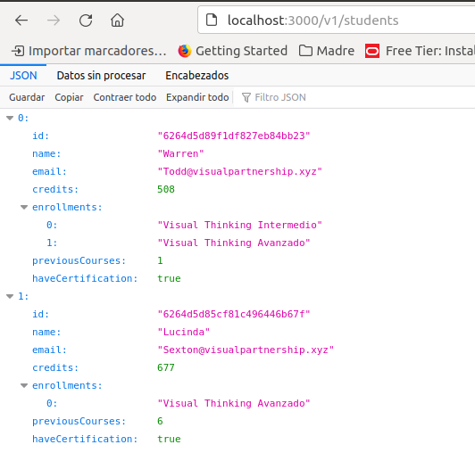
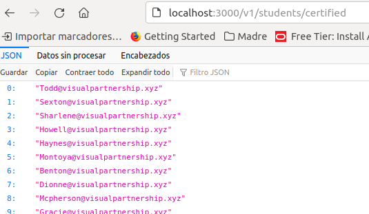
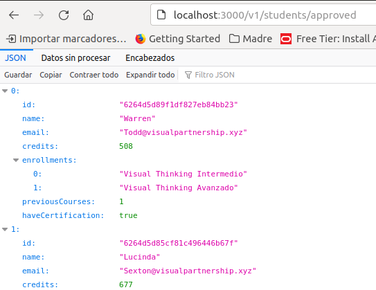

# Cursos de Visual Thinking API

## Dependencias

### Producción

Express en su versión 4.18.0

### Desarrollo

eslint en su versión 8.14.0

jest en su versión 27.5.1

## Diseño de componentes



### Reader

Encargado de leer y procesar el contenido del archivo que almacena la información de los usuarios.

### StudentService

Clase que implementa los servicios básicos de filtrado de los estudiantes.

### StudentController

Clase que conecta las peticiones del servidor con el StudentService. Aquí se carga la información de los usuarios, y se proporciona a los servicios para que puedan procesarla

### Server

Expone los puntos de acceso para obtener la información de los estudiantes

## Uso de api

Para el uso del API se deben de seguir los siguientes pasos:

```bash
#Instalar dependencias
npm i --omit dev
#Ejecutar servicio
npm run server
```

El servidor escuchará peticiones GET en el puerto 3000

### /v1/students/

Obtiene el listado completo de los estudiantes 



### /v1/students/certified

Obtiene el listado correos de los estudiantes que tienen certificación



### /v1/students/approved

Obtiene el listado de los estudiantes que tienen créditos con un valor superior a 500



## Implementación

Para la implementación se realizarón los siguientes pasos, guiado por la necesidad de cada uno de ellos para avanzar en el resultado esperado.

* Obtener estudiantes
  Se crean pruebas e implemenatición de método que permita la lectura de los estudiantes.
* Crear el servicio de students
  Se crean las pruebas e implementaciones para los siguientes métodos
  * **getStudentsWithCertification** - Obtiene el listado de los estudiantes que tiene certificación
  * **getStudentsWithCreditsMoreThan** - Obtiene el listado con los estudiantes que tienen créditos mayores a un valor especificado
* Crear el controlador de students
  Se crean los metodos que interactuan con el servicio de students
  * **getAllStudents** - Solicita todos los estudiantes y los envía 
  * **getMailOfCertifiedStudents** - Obtiene el listado de los estudiantes con certificación, y les aplica un map para regresar solo el listado de emails
  * **getApprovedStudents** - Obtiene el listado de los estudiantes que tengan créditos mayores a 500. Se esta tomando como posible caso de uso que el valor 500 significa que se aprobaron.
* Crear el servidor para acceder al servicio
  Se crean los enpoints para el uso del servicio
  * /v1/students/
  * /v1/students/certified
  * /v1/students/approved

